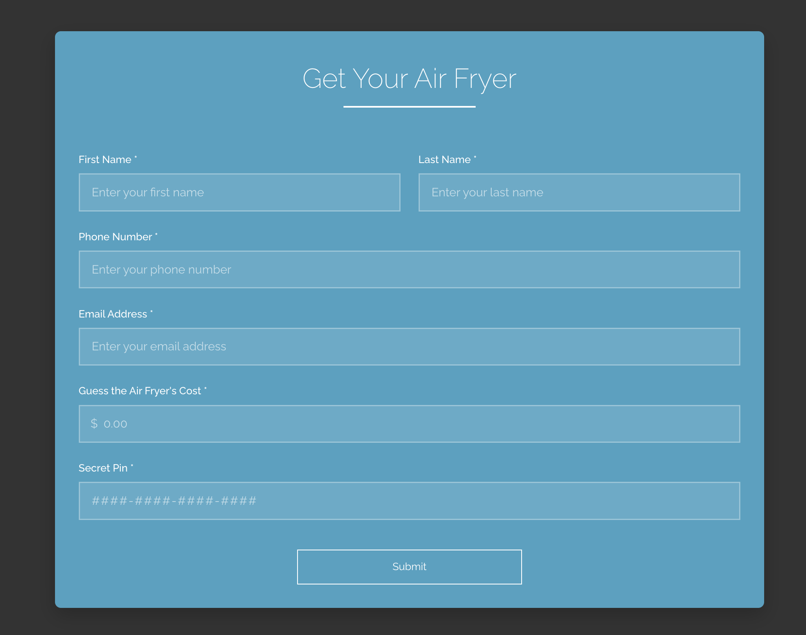

# Spidr Design Air Fryer Interest Form



## Overview
This project is a custom React interest form designed for Spidr Design's (fictitious) new air fryer landing page. The form is visually inspired by the Spidr Design brand and features a modern, clean, and user-friendly interface.

## Features
- **Fields:**
  - First Name
  - Last Name
  - Phone Number
  - Email Address
  - Guess the Air Fryer's Cost
  - Secret 16-digit Spidr PIN (auto-formatted)
- **Styling:**
  - Uses Raleway Thin font for a sleek, modern look
  - Custom color palette: dark gray background, blue form, white text
  - Responsive and accessible design
  - Animated underline for the title
  - Stylish button with hover effect
- **Functionality:**
  - Real-time validation and error messages
  - PIN field auto-formats as ####-####-####-####
  - On submit, form data is printed to the console

## Getting Started

### Prerequisites
- Node.js (v16 or higher recommended)
- npm or yarn

### Installation
1. Clone the repository:
   ```bash
   git clone <your-repo-url>
   cd interest-form
   ```
2. Install dependencies:
   ```bash
   npm install
   # or
   yarn install
   ```

### Running the App
```bash
npm start
# or
yarn start
```
The app will be available at [http://localhost:3000](http://localhost:3000).

## Design Inspiration
- **Brand:** Inspired by [Spidr Design](https://spidr.design/)
- **Font:** Raleway Thin for a modern, airy feel
- **Colors:**
  - Outer background: #333 (dark gray)
  - Form background: #43aed2 (blue, 90% opacity)
  - Text: White
- **Layout:** Centered, responsive, and visually appealing

## Screenshot


## License
This project is for demonstration purposes only and is not affiliated with Spidr Design.
